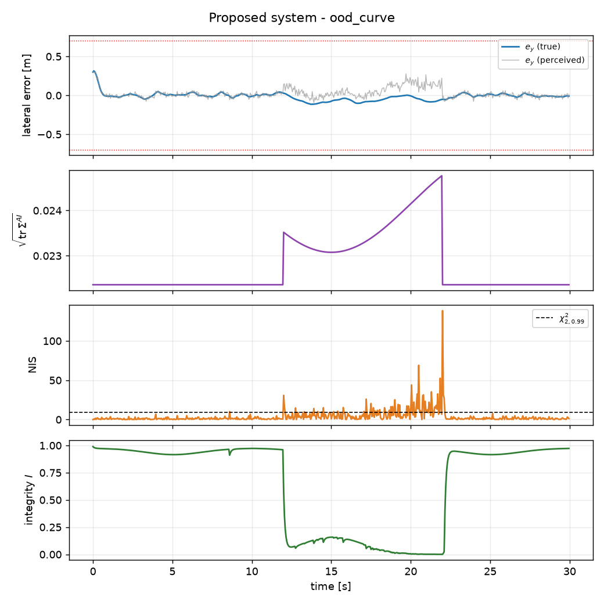
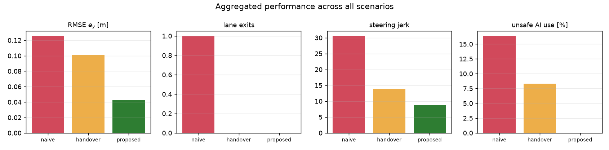
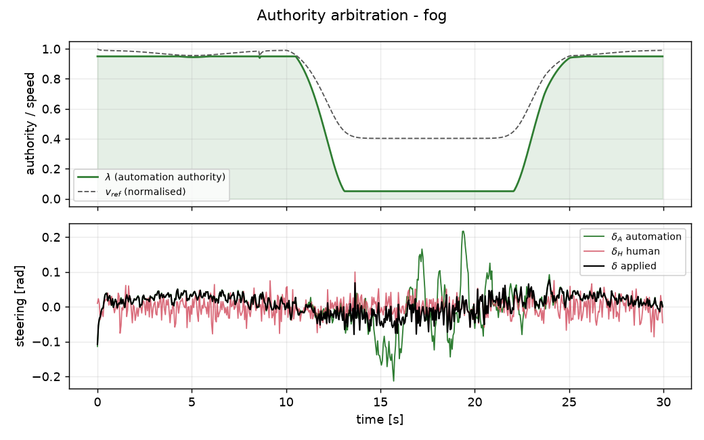
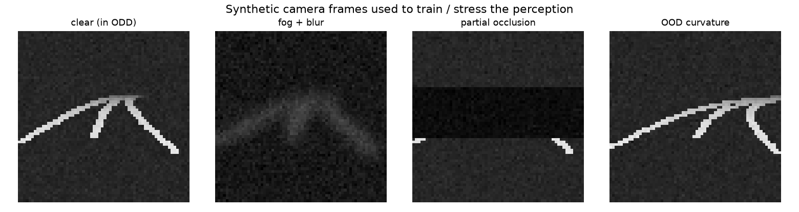

# TrustDrive MiniLab

**Integrity-aware shared control for autonomous driving under perception uncertainty.**

A compact, self-contained research demonstrator that asks one question:

> *What should an autonomous vehicle do when its AI perception becomes uncertain,
> and how should control authority be shared between automation and the driver?*

The full pipeline is a closed loop:

```
Camera image → CNN perception → uncertainty → integrity monitor → controller → shared control → vehicle
```

The core loop runs with **only `numpy` + `matplotlib`** (the LQR Riccati solver and
the Gaussian blur are implemented from scratch). A learned CNN perception front-end
is an **optional** drop-in that requires `torch`. The closed loop is built and
validated independently of the vision model.

---

## 1. Architecture

```
                       ┌──────────────────┐
   Camera image ──────▶│  CNN perception  │   (or SyntheticPerception)
                       │   (ensemble)     │
                       └────────┬─────────┘
                        estimate ŷ  +  epistemic Σ^AI
                                │
              ┌─────────────────┼──────────────────────┐
              ▼                 ▼                        ▼
   ┌────────────────┐   ┌───────────────┐      ┌──────────────────┐
   │ model predictor│──▶│  NIS monitor  │      │   ODD monitor    │
   │ (Kalman, f(x,u))│   │ ν'S⁻¹ν vs χ²  │      │ κ,brightness,…   │
   └────────────────┘   └───────┬───────┘      └────────┬─────────┘
                                └──────────┬────────────┘
                                           ▼
                                 ┌───────────────────┐
                                 │ integrity score I │  I = f(Σ^AI, NIS, ODD) ∈ [0,1]
                                 └─────────┬─────────┘
                                           │ I(t)
                      δ_H (human)          ▼            δ_A (LQR, gain-scheduled)
                          └────────▶ shared control ◀────────┘
                                δ = δ_ff + λ·fb_A + (1-λ)·δ_H
                                λ = Φ(I, workload),  v_ref = v_nom(0.4 + 0.6 I)
                                           │
                                           ▼
                                        Vehicle
```

The three signals - **epistemic uncertainty**, **model-consistency (NIS)** and **ODD
membership** - are fused into a single transparent integrity score, which then drives
both the *authority split* and the *operating envelope* (reference speed).

---

## 2. The scientific message in one figure

`figures/fig3_timehistories_ood_curve.png` (out-of-distribution curvature scenario):



On an unfamiliar sharp curve the image still looks perfectly valid, so the **ensemble
uncertainty barely moves** (≈ 4 %). It is the **model-based NIS that spikes above the
χ² threshold**, collapsing the integrity score and shifting authority away from the
automation. **Uncertainty alone is not enough**, which motivates the model-based
consistency monitor on top of the learned perception system.

---

## 3. Results (synthetic perception, seed 0)

Three architectures are compared on identical plant/perception/driver:

- **naive** - perception → LQR, full automation, no monitoring.
- **handover** - perception → LQR, *hard* switch to the human when reported uncertainty
  exceeds a threshold.
- **proposed** - perception → Kalman/NIS + ODD → integrity → smooth authority
  arbitration + speed contraction.

Aggregated over all four scenarios (`python -m experiments.benchmark`):

| method   | RMSE e_y [m] | max\|e_y\| [m] | lane exits | steer jerk | unsafe AI [%] |
| -------- | -----------: | -------------: | ---------: | ---------: | ------------: |
| naive    |        0.126 |          0.617 |          1 |      30.56 |          16.4 |
| handover |        0.101 |          0.400 |          0 |      13.93 |           8.3 |
| **proposed** |    **0.042** |      **0.315** |      **0** |   **8.79** |       **0.0** |

The decisive per-scenario result is **`ood_curve`**, where hard handover is *identical
to naive* (RMSE 0.187, 33 % unsafe AI usage) because reported uncertainty never crosses
its threshold - only the NIS catches the regime change, so the proposed system reaches
RMSE 0.052 with zero lane exits.

Full per-scenario tables: [`figures/results_table.md`](figures/results_table.md).

Aggregated bars and authority traces:




Example synthetic camera frames used to train / stress the perception:



---

## 4. Model

State - lateral / heading error w.r.t. the lane centre, `x = [e_y, e_psi]`:

```
e_y_{k+1}   = e_y_k   + v·sin(e_psi_k)·Ts
e_psi_{k+1} = e_psi_k + (v/L·tan(δ_k) - v·κ_k)·Ts
```

- **Control** - LQR on the linearised model with map-based curvature feed-forward
  `δ_ff = atan(L·κ)`, **gain-scheduled on speed** (a lightweight LPV scheme so the
  integrity-driven speed contraction never leaves the controller mistuned).
- **Perception** - ensemble mean `x̄` and covariance `Σ^AI = 1/(M-1) Σ(xᵢ-x̄)(xᵢ-x̄)ᵀ`.
- **Integrity monitor** - Kalman predictor `x̂_{k|k-1}=f(x̂,u)`, innovation
  `ν = y^AI - C x̂`, `S = C P Cᵀ + R^AI`, and **NIS `= νᵀ S⁻¹ ν`** vs a χ²(2) threshold.
- **ODD** - `{ |κ|<κ_max, brightness>b_min, blur<σ_max, occlusion<o_max }`.
- **Shared control** - feed-forward always applied (it comes from the map, not the
  camera); only the *feedback* authority `λ = Φ(I, workload)` is arbitrated, and the
  reference speed contracts as `v_ref = v_nom(0.4 + 0.6·I)`.

> **Full derivations:** every equation above is derived and mapped to the exact
> function that implements it in [`docs/MATH.md`](docs/MATH.md).

---

## 5. Scenarios

| scenario     | what happens                                            | expected outcome                      |
| ------------ | ------------------------------------------------------- | ------------------------------------- |
| `nominal`    | clear road, everything inside the ODD                   | `I ≈ 1`, automation drives            |
| `fog`        | blur/darkness ramp up, then a partial occlusion pulse   | `Σ^AI ↑`, `I ↓`, authority shifts     |
| `ood_curve`  | curvature exceeds the trained envelope (`|κ|=0.04`)     | `Σ^AI` flat, **NIS ↑**, `I ↓`         |
| `conflict`   | overloaded driver steers against the automation         | authority *stays* with automation     |

---

## 6. Repository layout

```
trustdrive-minilab/
├── README.md
├── requirements.txt
├── trustdrive/
│   ├── vehicle.py        # kinematic lane-error model + linearisation
│   ├── road.py           # procedural camera renderer + degradations (numpy blur)
│   ├── perception.py     # SyntheticPerception + optional CNNPerception ensemble
│   ├── cnn.py            # small CNN (torch, optional)
│   ├── uncertainty.py    # ensemble mean / covariance
│   ├── kalman.py         # model predictor + NIS
│   ├── integrity.py      # ODD + integrity score fusion
│   ├── controllers.py    # gain-scheduled LQR + shared-control arbitration
│   ├── driver.py         # delayed, noisy human model (workload, conflict)
│   ├── scenarios.py      # the four test scenarios
│   ├── simulation.py     # closed loop + metrics
│   └── plotting.py       # workshop figures
├── experiments/
│   ├── benchmark.py           # 3 methods × 4 scenarios → table + figures
│   └── train_perception.py    # optional CNN ensemble training (torch)
├── notebooks/workshop.ipynb   # 90-minute guided workshop
├── tests/test_smoke.py
├── models/   figures/   data/
```

---

## 7. Quick start

```bash
pip install -r requirements.txt          # numpy + matplotlib is enough for the core

python -m experiments.benchmark          # runs everything, writes figures/
python tests/test_smoke.py               # fast sanity checks
```

Optional learned perception (requires `torch`):

```bash
pip install torch
python -m experiments.train_perception --members 3 --epochs 8 --n 6000
python -m experiments.benchmark --cnn models/perception.pt
```

The `notebooks/workshop.ipynb` walks through the five parts of the 90-minute workshop:
lane keeping → learned perception → *can we trust it?* (uncertainty + NIS) →
integrity-aware shared control → discussion.

---

## 8. Discussion questions (Part V of the workshop)

- Is uncertainty enough, or do we need model-based consistency?
- How should an ODD be defined and monitored online?
- Should authority depend only on AI reliability, or also on driver state?
- How do we estimate workload and attention?
- Can integrity guarantees be provided rather than heuristics?

These lead directly into the trustworthy-interactive-autonomous-driving research agenda
(model-based estimation, integrity monitoring, LPV control, shared human-vehicle control).
